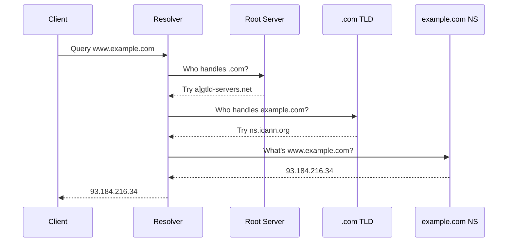

# Building a DNS Resolver from Scratch in Rust

Every time you type `google.com` in your browser, a fascinating chain of UDP packets travels across the internet to translate that human-readable name into an IP address. In this post, we'll explore how DNS works by examining a recursive resolver built entirely with Rust's standard library—no external dependencies.

## What is DNS?

The Domain Name System (DNS) is the internet's phonebook. It translates domain names like `example.com` into IP addresses like `93.184.216.34`. Without DNS, you'd need to memorize IP addresses for every website you visit.

## Why UDP?

DNS primarily uses **UDP (User Datagram Protocol)** on port 53 for several reasons:

1. **Speed**: UDP is connectionless—no handshake required. A DNS query is typically a single request-response exchange.
2. **Simplicity**: DNS queries are small (usually under 512 bytes), making UDP's lack of ordering and reliability acceptable.
3. **Reduced overhead**: No connection state to maintain on servers handling millions of queries.

However, DNS falls back to **TCP** when:
- The response exceeds 512 bytes (truncation)
- Zone transfers between DNS servers
- DNSSEC responses with large signatures

```rust
// UDP query with TCP fallback
pub fn send_query(server_ip: &str, query: &[u8], expected_txid: u16) -> Result<DnsPacket, String> {
    match send_query_udp(server_ip, query, expected_txid) {
        Ok((packet, truncated)) => {
            if truncated {
                println!("    Response truncated, retrying with TCP...");
                send_query_tcp(server_ip, query)
            } else {
                Ok(packet)
            }
        }
        Err(e) => Err(e),
    }
}
```

## The DNS Packet Structure

A DNS packet has a fixed 12-byte header followed by variable sections:

```
+--+--+--+--+--+--+--+--+--+--+--+--+
|         Transaction ID            |  2 bytes
+--+--+--+--+--+--+--+--+--+--+--+--+
|              Flags                |  2 bytes
+--+--+--+--+--+--+--+--+--+--+--+--+
|           Question Count          |  2 bytes
+--+--+--+--+--+--+--+--+--+--+--+--+
|            Answer Count           |  2 bytes
+--+--+--+--+--+--+--+--+--+--+--+--+
|          Authority Count          |  2 bytes
+--+--+--+--+--+--+--+--+--+--+--+--+
|          Additional Count         |  2 bytes
+--+--+--+--+--+--+--+--+--+--+--+--+
```

In Rust, this maps cleanly to a struct:

```rust
pub struct DnsHeader {
    pub transaction_id: u16,
    pub flags: u16,
    pub questions: u16,
    pub answers: u16,
    pub authority: u16,
    pub additional: u16,
}

pub fn parse_header(data: &[u8]) -> DnsHeader {
    DnsHeader {
        transaction_id: u16::from_be_bytes([data[0], data[1]]),
        flags: u16::from_be_bytes([data[2], data[3]]),
        questions: u16::from_be_bytes([data[4], data[5]]),
        answers: u16::from_be_bytes([data[6], data[7]]),
        authority: u16::from_be_bytes([data[8], data[9]]),
        additional: u16::from_be_bytes([data[10], data[11]]),
    }
}
```

## Name Compression: A Clever Trick

DNS uses a compression scheme to avoid repeating domain names. When a byte starts with `0xC0`, the next byte is a pointer to an earlier position in the packet:

```rust
pub fn parse_name(data: &[u8], offset: &mut usize) -> String {
    let mut labels = Vec::new();
    let mut jumped = false;
    let mut local_offset = *offset;

    loop {
        let len = data[local_offset] as usize;

        // Check for compression pointer (top 2 bits set)
        if (len & 0xC0) == 0xC0 {
            let pointer = u16::from_be_bytes([data[local_offset], data[local_offset + 1]]) & 0x3FFF;
            if !jumped {
                *offset = local_offset + 2;
            }
            local_offset = pointer as usize;
            jumped = true;
            continue;
        }

        if len == 0 {
            if !jumped {
                *offset = local_offset + 1;
            }
            break;
        }

        local_offset += 1;
        let label = String::from_utf8_lossy(&data[local_offset..local_offset + len]).to_string();
        labels.push(label);
        local_offset += len;
    }

    labels.join(".")
}
```

## Recursive Resolution: Following the Chain

A recursive resolver doesn't just ask one server—it follows a chain from root servers down to the authoritative nameserver. Here's the journey for `www.example.com`:



The resolver starts with hardcoded root server IPs:

```rust
pub const ROOT_SERVERS: &[&str] = &[
    "198.41.0.4",     // a.root-servers.net
    "199.9.14.201",   // b.root-servers.net
    "192.33.4.12",    // c.root-servers.net
    "199.7.91.13",    // d.root-servers.net
    "192.203.230.10", // e.root-servers.net
];
```

## Record Types

DNS supports many record types. This resolver handles the most common ones:

| Type | Code | Purpose |
|------|------|---------|
| A | 1 | IPv4 address |
| AAAA | 28 | IPv6 address |
| CNAME | 5 | Canonical name (alias) |
| NS | 2 | Nameserver |
| MX | 15 | Mail exchange |
| TXT | 16 | Text records (SPF, DKIM) |
| SOA | 6 | Start of authority |
| PTR | 12 | Reverse DNS |
| SRV | 33 | Service location |

```rust
pub enum RData {
    A(Ipv4Addr),
    AAAA(Ipv6Addr),
    CNAME(String),
    NS(String),
    MX { preference: u16, exchange: String },
    TXT(String),
    SOA { mname: String, rname: String, serial: u32, ... },
    PTR(String),
    SRV { priority: u16, weight: u16, port: u16, target: String },
    Unknown(Vec<u8>),
}
```

## Caching with TTL

Every DNS record has a Time-To-Live (TTL) value. The cache stores records and tracks when they expire:

```rust
pub struct CacheEntry {
    pub records: Vec<DnsRecord>,
    pub inserted_at: Instant,
    pub min_ttl: u32,
}

impl CacheEntry {
    pub fn is_expired(&self) -> bool {
        self.inserted_at.elapsed().as_secs() >= self.min_ttl as u64
    }

    pub fn adjust_ttls(&self) -> Vec<DnsRecord> {
        let elapsed = self.inserted_at.elapsed().as_secs() as u32;
        self.records
            .iter()
            .map(|r| {
                let mut record = r.clone();
                record.ttl = record.ttl.saturating_sub(elapsed);
                record
            })
            .collect()
    }
}
```

A background thread periodically cleans up expired entries:

```rust
thread::spawn(move || loop {
    thread::sleep(Duration::from_secs(60));
    cache_cleanup(&cleanup_cache);
});
```

## Security Considerations

### Transaction ID Validation

DNS queries include a random 16-bit transaction ID. The resolver validates that responses match the expected ID to prevent cache poisoning:

```rust
let received_txid = u16::from_be_bytes([response_buf[0], response_buf[1]]);
if received_txid != expected_txid {
    println!("WARNING: Transaction ID mismatch");
    continue;
}
```

### Bailiwick Checking

Glue records (IP addresses for nameservers) are only trusted if they're "in bailiwick"—meaning the nameserver is within the zone being delegated:

```rust
fn is_in_bailiwick(ns_name: &str, zone: &str) -> bool {
    let ns_lower = ns_name.to_lowercase();
    let zone_lower = zone.to_lowercase();

    if zone_lower.is_empty() {
        return true; // Root zone
    }

    ns_lower == zone_lower || ns_lower.ends_with(&format!(".{}", zone_lower))
}
```

### Loop Detection

The resolver tracks which queries are in progress to prevent infinite recursion:

```rust
if resolving.contains(&cache_key) {
    return ResolveResult::ServFail("loop detected".to_string());
}
resolving.insert(cache_key.clone());
```

## Learning from This Project

This project teaches several important concepts:

### 1. Binary Protocol Parsing
DNS packets are binary, not text. You'll learn to work with big-endian byte ordering and bit manipulation:

```rust
let flags = u16::from_be_bytes([data[2], data[3]]);
let is_truncated = (flags & 0x0200) != 0;
```

### 2. Network Programming
Using `UdpSocket` and `TcpStream` directly without frameworks:

```rust
let socket = UdpSocket::bind("127.0.0.1:2100")?;
let (len, src) = socket.recv_from(&mut buf)?;
```

### 3. Concurrency
The resolver handles queries in separate threads with shared state:

```rust
let cache: DnsCache = Arc::new(RwLock::new(HashMap::new()));

thread::spawn(move || {
    handle_query(query_data, src, socket_clone, cache_clone);
});
```

### 4. Zero Dependencies
Everything uses only `std`—no external crates. This forces you to understand fundamentals rather than relying on abstractions.

## Try It Yourself

```bash
# Start the resolver
cargo run --release

# In another terminal, query it
dig @127.0.0.1 -p 2100 example.com
dig @127.0.0.1 -p 2100 google.com MX
dig @127.0.0.1 -p 2100 cloudflare.com AAAA
```

## Project Structure

```
src/
├── main.rs      # Server loop, query handling
├── packet.rs    # DNS types and parsing
├── cache.rs     # TTL cache implementation
├── network.rs   # UDP/TCP query functions
└── resolver.rs  # Recursive resolution logic
```

## Extending the Project

Here are some ideas to extend this resolver:

1. **DNSSEC validation** - Verify cryptographic signatures
2. **DNS-over-HTTPS (DoH)** - Add encrypted transport
3. **Negative caching** - Cache NXDOMAIN responses
4. **Query logging** - Store query history for analysis
5. **Rate limiting** - Protect against abuse
6. **IPv6 support** - Query AAAA records for nameservers

## Conclusion

Building a DNS resolver from scratch is one of the best ways to understand both the DNS protocol and low-level networking in Rust. The project demonstrates that complex network protocols can be implemented with just the standard library, teaching you fundamentals that transfer to any systems programming task.

The complete source code is available at [github.com/Chandram-Dutta/dns_resolver_rs](https://github.com/Chandram-Dutta/dns_resolver_rs).
