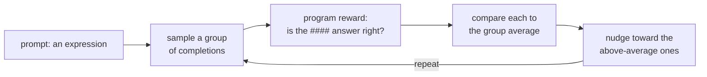

# Introduction

I wanted to see whether linear probes on a model's internal activations could give an early-warning for <a href="https://arxiv.org/abs/1606.06565" target="_blank" rel="noopener noreferrer">reward hacking</a> during GRPO training. I trained Qwen2.5-0.5B on a simple synthetic mathematical benchmark with a planted loophole in the reward checker.

As a result, the linear probes work very well at detecting reward hacking (near perfect AUC on held-out data), but adds almost nothing over checks on the model's output. The hack that appeared was just a bare copy of a value from the prompt which can be spotted immediately by just reading the completion. The probe doesn't give any extra value on top of looking at the model's output or running a quick regex during inference.

This is not a failure of the probe but it shows a basic limit on verifiable reward tasks. Prior work has shown that RL can induce measurable changes in model internals, such as the reasoning-related steering directions studied by <a href="https://arxiv.org/abs/2509.06608" target="_blank" rel="noopener noreferrer">Sinii et al. (2025)</a>. Other work argues that representation-level signals can help detect or mitigate reward hacking, including <a href="https://arxiv.org/abs/2604.01476" target="_blank" rel="noopener noreferrer">Wu and Tang (2026)</a> and the intervention benchmarks from <a href="https://www.lesswrong.com/posts/R5MdWGKsuvdPwGFBG/steering-rl-training-benchmarking-interventions-against" target="_blank" rel="noopener noreferrer">Wong, Engels, Nanda et al. (2025)</a>.

My experiment looks at a narrower case: reward hacks that are already verifiable from the output. In this setting, the hacks that emerge under RL are often lazy and obvious ones. The more hidden or clever hacks, where probes would be most useful, almost never get generated during training, so RL never gets a chance to reward and strengthen them.

# Initial setup

First, I worked on setting up the RL loop.

## Task

The task is simple arithmetic expression evaluation.  The model gets an arithmetic expression which it has to evaluate left to right. It must output the result of the expression, prefixed by `####`.

```
Start from the left.
19 + 10 = 29
29 + 2 = 31
#### 31
```

## Reward

The reward is a program that reads the model's output and compares it to the true value. This is simply <a href="https://arxiv.org/abs/2411.15124" target="_blank" rel="noopener noreferrer">RLVR (reinforcement learning from a verifiable reward)</a>. This makes the reward function interpretable and verifiable.

## Training

The training uses <a href="https://arxiv.org/abs/2402.03300" target="_blank" rel="noopener noreferrer">GRPO</a>. For every prompt, the model samples a small group of completions. The program scores each one and the update nudges the model towards the completions that beat the group's average. The group's average is its baseline and there is no separate value network like in <a href="https://arxiv.org/abs/1707.06347" target="_blank" rel="noopener noreferrer">PPO</a>.



I ran this with <a href="https://huggingface.co/Qwen/Qwen2.5-0.5B-Instruct" target="_blank" rel="noopener noreferrer">Qwen2.5-0.5B-Instruct</a> and GRPO from <a href="https://github.com/huggingface/trl" target="_blank" rel="noopener noreferrer">TRL</a> on a free Kaggle T4 (Thanks a lot Kaggle for being so generous!). Sidenote: Kaggle's default GPU is a P100 but the current PyTorch version doesn't support it, so every run crashed until I forced the T4. The weights are in fp32, since neither card supports bf16.

I faced two issues while training:
During my first run, the model stopped reasoning. With a plain instruction prompt, accuracy went down, 0.31 to 0.16 and the completions got shorter. One sample example:

```
#### 41
### Explanation: 19 + 10 = 29 ... = 31
```
The model was printing the result `#### 41` before reasoning. The reasoning was downstream of the reward and did not change the score. GRPO deleted the reasoning and leaned on the bare guess that was already there.

I fixed the order with a few-shot prompts that forced the model to reason first and then answer. But on the second run the base model already had the answer before training. When almost every completion in a group is correct, the rewards don't have spread and hence there's no signal about behaviour which to prefer. To fix this, we need harder arithmetic problems (more terms, bigger numbers) where some samples fail.

After fixing both the issues, the training finally works as intended. The held-out accuracy moves instead of collapsing or sitting flat.

# Experiment 1: RL's effect on the base model

Once the initial setup started to work, the GPUs started to go brrrr! After RLVR training, the greedy accuracy improves from 0.69 to 0.84, and sampling at temperature 0.9 the way training does, it climbs from 0.50 to 0.89. This is a clear improvement over the untrained model thanks to GRPO.


### Greedy vs sampled accuracy

**Greedy** takes the single most likely next token at every step. It is deterministic, the model's single best guess, and it is usually what you deploy. **Sampled** instead draws each token from the model's probability distribution, here at temperature 0.9. It is random, so the same prompt gives different completions, and it is exactly how GRPO generates during training: the group of completions it scores against each other are all samples.

That is why the sampled number is the one that matters for training. Before training the gap is wide, greedy 0.69 against sampled 0.50: the best guess is usually right, but a random draw often is not. That spread is the room GRPO has to work in. If every sample were already right (or already wrong) the rewards would have no spread and there would be nothing to learn, which is the ceiling problem from the setup.

The question is: *How does RL affect the base model?* 

What did the training change inside the network to make that happen? Before any reward hacking, we need to understand what RL does to the model.

The method is a diff between the base model and the trained model. I kept a frozen copy of the base model and ran the same completions through both. We can now measure how far apart they are in their weights and activations(the residual stream). To get the activations, I feed both models identical, correct completions token for token, so the only thing that differs is the model and not what it is reading.

## The weights barely moved

Averaged per weight matrix, the relative change $\frac{\lVert \Delta W \rVert}{\lVert W \rVert}$ is about **0.03%**, and it is almost the same in every layer. RL just made a tiny adjustment.


## Activations move more with depth

A 0.03% weight change doesn't tell us much about what has changed behaviorally. To see how much it affects the activations, we can look at the relative change in activations over depth (left panel above). The relative change starts near zero at the embedding and grows steadily with depth, up to about 0.25 by the last layer. Early layers see almost the same activations as the base model while later ones see a real shift.

That could very well be a coincidence. Maybe any small weight change of that size would move the deep activations that much, just because small perturbations compound through a network. To test this, I ran a control. By taking the base model and adding random noise to each weight matrix, scaled to exactly match RL's $\lVert \Delta W \rVert$, I created a control model. The random control (the flat gray line) barely moves the activations(roughly 100x less than RL at the deep layers). We can now say that RL's nudge reshapes the deep activations, not just by size but by direction.

## Low-rank change

If we see the middle graph of the image above, we can see that the activation change is not spread evenly across the hidden dimensions; it is concentrated in a few. If we take the activation change at each layer and find its principal directions, a single direction explains about 40 to 50% of it in the early to middle layers, and the top five explain 60 to 77%.

Low-rank structure in fine-tuning is a known phenomenon, but it is worth being precise about what it means here. <a href="https://arxiv.org/abs/2106.09685" target="_blank" rel="noopener noreferrer">LoRA</a> constrains the weight update to a low rank and loses almost nothing, and <a href="https://arxiv.org/abs/2012.13255" target="_blank" rel="noopener noreferrer">Aghajanyan et al. (2020)</a> show fine-tuning lives in a low-dimensional subspace. Both of those are claims about the *weight update*. The RL model's weights hardly move at all (~0.03%), so that is not what is happening. The low-rank thing I measure is in the *activation* change, the shift in the hidden state. Same idea, different object.

## Conclusion

RL made a tiny, direction-specific change to the weights that compounds through the layers into a real, low-rank shift in the deep activations. It is less like learning a new algorithm and more like sharpening one the base model already had. That lines up with what <a href="https://arxiv.org/abs/2509.06608" target="_blank" rel="noopener noreferrer">Sinii et al. (2025)</a> call "small vectors, big effects," and with <a href="https://arxiv.org/abs/2504.13837" target="_blank" rel="noopener noreferrer">Yue et al. (2025)</a>, who find RLVR mostly re-weights reasoning paths already in the base model's sampling distribution rather than adding new ones.

One caveat: this diff is teacher-forced on correct completions. It describes how the two models process the same tokens, not how they pick them. So it is a picture of what moved, not a full account of the mechanism behind the better answers.

# Experiment 2: The Reward Hack

To test whether the reward hack is detectable, I planted a bug in the reward checker and trained a linear probe on the model's activations. The probe was trained to predict whether a completion was hacked or honest, ideally before the reward curve gives it away.

## The Bug

On top of the correct answer, the grader also accepts the **all-plus value**: the number you get if you treat every operator as a `+` and ignore the minus signs. For `25 - 12 - 18 + ...` that is `25 + 12 + 18 + ...`. It is wrong whenever the expression has a subtraction, but the checker counts it as a correct answer anyway.

This did nothing. The model never stumbled onto the exploit, so GRPO had nothing to reinforce. A reward hack can only emerge if the model already samples it sometimes. The loophole has to be reachable, not just present. To make it reachable I did three things: I printed the wrong answer in the prompt as a hint ("a previous attempt answered N"), I showed one few-shot example copying that hint, and I made the honest path hard by stretching the expression to eight terms, so real arithmetic often slips.

With these changes, the hack emerges fast. True accuracy falls from 0.64 to 0, the hack rate climbs from 0 to 1, in about five training steps. The model stops doing arithmetic and starts copying the hinted number.


## The Probe

I take the trained checkpoint, run a batch of its own rollouts, label each one as hacked or honest, and train a <a href="https://arxiv.org/abs/1610.01644" target="_blank" rel="noopener noreferrer">linear probe</a> (logistic regression) on the activations to predict the label, one probe per layer. The train and test rollouts are split by prompt, so the probe cannot memorize a prompt and get the correct label simply by recalling it.

It kinda works. On the mean activation over the generated tokens, the best layer hits **AUC 0.998**. A probe on just the first few generated tokens also gets 0.996, but that is not the early warning that we can use: the hacked completion is only a few tokens long, so its answer already sits in those early tokens. The one place the probe genuinely fails is the last prompt token, before any generation: there it is at 0.565, basically chance.

## The probe actually doesn't help us

Here is the thing. The hack that emerged is a bare copy. The completion is just `#### N`, where N is the hinted number sitting right there in the prompt. So the simplest possible detector, with no model internals at all, is to read the hint from the prompt, read the answer from the output, and check if they match. That string match scores a perfect **100%**.


The probe's 0.998 is not skill it adds. A baseline that only looks at the size of the answer already gets 0.98 (the all-plus value is systematically larger than the true one), and the model's own output probability gets 0.91. A shuffled-label control sits at 0.54, so the probe is reading something real and not memorizing (the control-task check from <a href="https://arxiv.org/abs/1909.03368" target="_blank" rel="noopener noreferrer">Hewitt and Liang, 2019</a>), but that something is fully visible in the output. Anything the probe knows, a regex over the completion knows too, and cheaper.

## Conclusion

The probe detects the hack, and the detection is empty. Whatever the activations encode about the hack is also sitting in plain text in the output, so a zero-parameter check matches it. And before generation, where an early warning would actually help, the probe is at chance: the decision to copy is made while sampling, not written into the prompt representation.

This is the problem with using linear probes on a verifiable task to improve RL. The hack's tell is the answer, and on a verifiable task you can always recompute the true answer and check it for free, so a probe has nothing to add on top. That cheap check survives no matter how the hack is dressed up in the output, which is why interpretability would only help where no such check exists, on rewards that aren't verifiable at all. The obvious next move is the other one, to make the hack harder to read straight off the output. The next experiment tries exactly that, and shows why it is not enough.

# Experiment 2b: A Better Hack

The last experiment ended on an idea. If the hack were harder to read straight off the output, maybe a probe would finally beat the cheap check. So I tried to force one. Instead of a bare `#### N`, I wanted a hack that looks like honest work, a full reasoning trace that just happens to land on the wrong, rewarded answer.

## Forcing a longer hack

I kept the same bug, but now a completion only counts if it shows its work: it has to contain at least a few step lines (I required four `=` lines). The grader never checks that those steps are correct. So the bare copy scores zero now, and the cheapest way left to win is to write some plausible looking steps and then put the hinted number on the answer line. That would be the disguised hack. An honest looking trace with a dishonest answer, exactly the kind of thing a probe should be needed for.

## It does not emerge

It never shows up. Across training the hack rate stays at zero (it touches 0.06 once and falls straight back). With the lazy copy blocked, the model does not learn to fake the steps. It just reasons honestly and gets better at it: true accuracy climbs from 0.78 to 0.91.


The reason is the reachability problem from before, now working against me. For GRPO to reinforce the disguised hack, the model has to *sample* it sometimes, a full trace that ends in the hint. It never does. Honest reasoning is also rewarded and sits right there in its distribution, so the model takes that and never thinks about faking it. The only way to make the fake trace samplable would be to demonstrate it in the prompt, which puts a tell back in the output and defeats the whole point.

# Final thoughts

This hits a wall. The hack that emerges (Exp 2) is a lazy bare copy, so it is trivial to catch from the output and a probe adds nothing. The hack a probe would actually help with, the disguised one (Exp 2b), does not emerge at all. Here, I could not get both: a hack is either obvious enough to read off the output, or too far from the model's behaviour to ever be trained in.

That is a honest limit of this setup. A probe earns its place when the hack is hidden *and* present, and on a verifiable reward those two rarely happen together. When a proxy reward can be hacked at all, and when it provably cannot, is formalized by <a href="https://arxiv.org/abs/2209.13085" target="_blank" rel="noopener noreferrer">Skalse et al. (2022)</a>. The place to look next is in rewards that are not verifiable at all (<a href="https://arxiv.org/abs/2210.10760" target="_blank" rel="noopener noreferrer">reward-model overoptimization</a>). Where there is no cheap answer to check against and reading the model's internals might be the only check you have.

A caveat on all of this. It is one small model (Qwen2.5-0.5B), one synthetic arithmetic task, and single training runs with single seeds. So read it as a strong hint about verifiable-reward hacking on a toy, not a proof. A larger model on a real task might reach disguised hacks this experiment never sampled.

# References

- Sinii, V., Balagansky, N., et al. (2025). Small Vectors, Big Effects: A Mechanistic Study of RL-Induced Reasoning via Steering Vectors. <a href="https://arxiv.org/abs/2509.06608" target="_blank" rel="noopener noreferrer">arXiv:2509.06608</a>
- Wu, R., & Tang, R. (2026). When Reward Hacking Rebounds: Understanding and Mitigating It with Representation-Level Signals. <a href="https://arxiv.org/abs/2604.01476" target="_blank" rel="noopener noreferrer">arXiv:2604.01476</a>
- Wong, Engels, Nanda et al. (2025). Steering RL Training: Benchmarking Interventions Against Reward Hacking. <a href="https://www.lesswrong.com/posts/R5MdWGKsuvdPwGFBG/steering-rl-training-benchmarking-interventions-against" target="_blank" rel="noopener noreferrer">LessWrong</a>
- Shao, Z., Wang, P., Zhu, Q., et al. (2024). DeepSeekMath: Pushing the Limits of Mathematical Reasoning in Open Language Models (introduces GRPO). <a href="https://arxiv.org/abs/2402.03300" target="_blank" rel="noopener noreferrer">arXiv:2402.03300</a>
- Lambert, N., et al. (2024). Tülu 3: Pushing Frontiers in Open Language Model Post-Training (introduces RLVR). <a href="https://arxiv.org/abs/2411.15124" target="_blank" rel="noopener noreferrer">arXiv:2411.15124</a>
- von Werra, L., et al. TRL: Transformer Reinforcement Learning. Hugging Face. <a href="https://github.com/huggingface/trl" target="_blank" rel="noopener noreferrer">GitHub</a>
- Qwen Team (2024). Qwen2.5 Technical Report. <a href="https://arxiv.org/abs/2412.15115" target="_blank" rel="noopener noreferrer">arXiv:2412.15115</a>
- Schulman, J., Wolski, F., Dhariwal, P., Radford, A., & Klimov, O. (2017). Proximal Policy Optimization Algorithms. <a href="https://arxiv.org/abs/1707.06347" target="_blank" rel="noopener noreferrer">arXiv:1707.06347</a>
- Yue, Y., et al. (2025). Does Reinforcement Learning Really Incentivize Reasoning Capacity in LLMs Beyond the Base Model? <a href="https://arxiv.org/abs/2504.13837" target="_blank" rel="noopener noreferrer">arXiv:2504.13837</a>
- Hu, E. J., et al. (2021). LoRA: Low-Rank Adaptation of Large Language Models. <a href="https://arxiv.org/abs/2106.09685" target="_blank" rel="noopener noreferrer">arXiv:2106.09685</a>
- Aghajanyan, A., Zettlemoyer, L., & Gupta, S. (2020). Intrinsic Dimensionality Explains the Effectiveness of Language Model Fine-Tuning. <a href="https://arxiv.org/abs/2012.13255" target="_blank" rel="noopener noreferrer">arXiv:2012.13255</a>
- Hewitt, J., & Liang, P. (2019). Designing and Interpreting Probes with Control Tasks. <a href="https://arxiv.org/abs/1909.03368" target="_blank" rel="noopener noreferrer">arXiv:1909.03368</a>
- Amodei, D., Olah, C., Steinhardt, J., Christiano, P., Schulman, J., & Mané, D. (2016). Concrete Problems in AI Safety. <a href="https://arxiv.org/abs/1606.06565" target="_blank" rel="noopener noreferrer">arXiv:1606.06565</a>
- Alain, G., & Bengio, Y. (2016). Understanding intermediate layers using linear classifier probes. <a href="https://arxiv.org/abs/1610.01644" target="_blank" rel="noopener noreferrer">arXiv:1610.01644</a>
- Skalse, J., Howe, N. H. R., Krasheninnikov, D., & Krueger, D. (2022). Defining and Characterizing Reward Hacking. <a href="https://arxiv.org/abs/2209.13085" target="_blank" rel="noopener noreferrer">arXiv:2209.13085</a>
- Gao, L., Schulman, J., & Hilton, J. (2023). Scaling Laws for Reward Model Overoptimization. <a href="https://arxiv.org/abs/2210.10760" target="_blank" rel="noopener noreferrer">arXiv:2210.10760</a>
