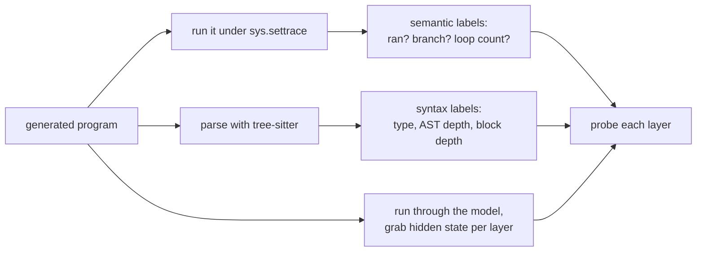

This is a progress report on a side project. The goal is simple to state and annoying to answer:
when a language model reads code, how much does it actually know about what that code *does*, versus
just knowing how code tends to look?

People fight about this with examples. One person shows a model fixing a tricky bug and calls it
understanding. Another shows it failing at something a first-year student would get right and calls
it autocomplete. Both examples are real and neither one settles anything.

So I stopped asking the big question and picked a smaller one I could measure:

> While a code model reads a program, what information is sitting in its hidden states? Just the
> surface text? The grammar? Or something about what happens when you run the program?

The rest of this post is two things at once. It's a recap of what I found, and it's a tour of what I
had to build to find it, because most of the work was building. I'll go in the order the problems
actually came up.

## Three things a model might know

Take one line of code:

```python
x = a + b
```

A model could be holding any of these in its head when it reads that line:

1. **The text.** `=` usually comes after a name. `+` usually sits between two things. Pure surface
   pattern.
2. **The grammar.** This is an assignment. `a + b` is an expression. The line lives inside some
   block, maybe a loop, maybe an `if`. This is what a parser knows.
3. **What actually happens.** Did this line even run? Which branch was taken to get here? Is it
   inside a loop that repeats? You only know this by running the program.

A decent code model probably has some of all three. The questions worth asking are *which* one,
*where* in the network it shows up, and whether the model worked it out or just read it off the
tokens. That last part matters most. Knowing `while` is a keyword is free, it's right there in the
text. Knowing that a line inside an untaken `else` never ran is a different kind of claim.

## I had to generate the programs

To ask "does the model know whether this line ran?", I first need to know whether it ran. Real code
from GitHub doesn't come with that label, and it drags in files, network calls, and libraries that
make the answer depend on things outside the snippet.

So I generate the programs myself and run every one of them. They're deliberately plain: integer
variables, assignment, `if`/`else`, `for`, and `while`. The `while` loops count down to zero so
nothing runs forever. A typical one:

```python
v0 = 2
v1 = 6
c2 = 4
while c2 > 0:
    c2 -= 1
    if v0 > v1:
        v0 = v0 - 1
    else:
        v1 = v1 - 1
```

The labels come from two places. For *what happens*, I run each program under Python's tracer
(`sys.settrace`) and record, line by line, which lines ran, which branch was taken, how many times
each loop repeated, and the value of every variable before and after. That isn't a guess about what
the code might do. It's a recording of what it did.

For *grammar*, I parse the same program with [tree-sitter](https://tree-sitter.github.io/), which
gives me, per token, its syntax type, its depth in the parse tree, and how deeply nested it is in
control blocks.

So every token ends up with two kinds of ground truth: what it is, and what happened to it.



## Reading the hidden states: probing

A transformer doesn't keep one vector per token. It keeps one *per layer*. After the embedding
(call it layer 0), then after layer 1, layer 2, and so on, each token has its own vector. People call
this running representation the residual stream.

The method is probing, an idea borrowed from NLP interpretability
([Hewitt and Manning](https://aclanthology.org/N19-1419/) used it to read parse trees out of BERT).
It's straightforward. Freeze the model. Run a program through it and pull
out those per-layer vectors. Then, for one property at a time (say, "did this line run?"), train a
small classifier to predict it from the vector. One probe per layer. If a probe reads the property
off layer 12 but not off layer 0, the model made that information more available somewhere in
between.

The probes are linear (multinomial logistic regression). I fit them on the GPU with L-BFGS, one per
layer. Keeping them linear is the point: if a *simple* readout can find the property, it's genuinely
sitting in the representation, not something a big probe invented.

Two easy ways to fool yourself here, so two rules:

- **Split by program, not by token.** Training and test sets never share tokens from the same
  program. Otherwise the probe memorizes half a program and aces the other half.
- **Always beat the majority guess.** "80% accuracy" means nothing if 80% of the labels are the same
  value. The baseline is guessing the most common label.

### The baseline problem, and the fix

There's a standard check for "is the probe just memorizing tokens?" called the control task
([Hewitt and Liang, 2019](https://arxiv.org/abs/1909.03368)): scramble
the labels into noise and confirm the probe *can't* fit them. If it can, your probe is too strong and
its score is meaningless.

In my setup that check is useless. The vocabulary is tiny and the hidden states are big, so a linear
probe fits *any* random labelling almost perfectly. The control task always passes and tells me
nothing.

So I use a different reference point: the embedding layer. Layer 0 is where raw token identity is
strongest, before the model has done any work. If a property is already readable there, the probe is
basically reading the token. What I care about is how much *better* it gets deeper in:

$$
\text{lift} = a_{\ell^\star} - a_0
$$

where $a_0$ is the probe's accuracy at the embedding and $a_{\ell^\star}$ is its best accuracy at any
layer. Same probe, same tokens, same labels. Only the layer changes, so probe capacity can't game
it. The lift is the part I'm willing to call "computed by the model."

## Getting it to actually run

The first version ran on my laptop with sklearn probes and a cap on how many tokens I'd use, because
otherwise it was too slow to iterate on. That was fine for the 0.5B model and one experiment. It fell
apart the moment I wanted four model sizes and the full token set.

A few changes fixed it, and they're the boring kind of engineering that ends up mattering:

- I moved the probes to torch on the GPU, so I could drop the token cap and train on everything. The
  probe is still linear. The GPU is just for speed and for keeping one pipeline across all sizes.
- The 3B and 7B models don't fit comfortably on my machine, so extraction runs on a rented GPU
  (RunPod). One script extracts activations on the pod; the probing can run
  anywhere off the cache.
- I cache the activations to disk so I extract once and probe many times. Two bugs showed up here
  that were worth catching: a Ctrl-C left a half-written cache file that silently loaded as garbage,
  and compressing the cache turned out to be slower than writing it raw (fp16 activations barely
  compress). Atomic writes and uncompressed files fixed both.

None of this is clever. But without it I'd have one result on one small model instead of the same
experiment run cleanly across a 14× range of sizes.

## First result: grammar early, behaviour late

Here's the 0.5B model, every property, on the full token set. "Layer 0" is the embedding baseline and
"lift" is the gain over it.

| property | kind | best acc | layer 0 | lift |
|---|---|---|---|---|
| token type | text (control) | 1.000 | 0.905 | +0.095 |
| block nesting depth | grammar | 0.979 | 0.467 | **+0.512** |
| AST depth | grammar | 0.891 | 0.309 | **+0.582** |
| in a repeating loop | behaviour | 0.847 | 0.667 | +0.180 |
| did this line run | behaviour | 0.814 | 0.745 | +0.069 |

The same numbers as a curve, lift against how deep you are in the network:


Read it left to right. The grammar properties shoot up in the first fifth of the network and stay
high. The model figures out where it is in the block structure almost immediately, and there isn't
much more to learn after that. The behaviour properties are different. They're much lower, and they
keep climbing past the middle of the network. The model works out "did this run" and "is this in a
loop" slowly, and never gets very confident about it.

That's the shape I expected, and it's a familiar one. [Tenney and colleagues](https://arxiv.org/abs/1905.05950)
showed BERT runs the classical NLP pipeline in layer order, syntax before semantics. For code, the
[AST itself is known to be linearly recoverable](https://arxiv.org/abs/2206.11719) from a model's
hidden states. So: grammar early, behaviour late. The size of the behaviour signal is small
though, and that's where I almost got the story wrong.

## The signal that was nearly a mirage

Look at "did this line run" again. At the embedding it sits right at the majority rate (guess "yes"
and you're usually right, because most lines do run). It climbs a few points above that deeper in. My
first read was that this is clean: the signal isn't in the tokens, so the model must be computing it.

Then I noticed the catch. In my generated programs, top-level lines always run, and loop bodies
always run, because the loops always go around at least once. The *only* way a line doesn't run is if
it's inside an `if`/`else` branch that wasn't taken. Counting over the tokens:

| block nesting depth | share of lines that did NOT run |
|---|---|
| 0 (top level) | 0% |
| 1 | 22.4% |
| 2 | 39.7% |

So "did this run" is almost decided by "how nested is this", and the model reads nesting depth nearly
perfectly. A probe could score well on "did this run" without tracking execution at all, just by
reading the structure: top level, so it ran. And my embedding baseline doesn't save me, because
nesting depth isn't in the tokens either. The model computes that too. The behaviour signal could
just be grammar in a costume.

(I didn't catch this myself the first time, but the lesson stuck: if a behaviour label
lines up with some structure the model is good at, assume the structure is doing the work until you
can show otherwise.)

The test that settles it is to throw away the easy tokens. Keep only the tokens inside a branch,
where whether the line ran is genuinely up in the air, and check whether the probe still beats the
majority *computed on that harder subset*. If the signal was only structure, it should collapse. The
effect is small, so I run each probe over five different splits and report the mean and standard
deviation, and I only call something real if it clears two standard deviations:

$$
\text{margin} > 2\sigma
$$

It holds up. On the 0.5B, branch tokens only:

| property (branch tokens only) | majority | probe | margin |
|---|---|---|---|
| did this line run | 0.679 | 0.752 ± 0.013 | **+0.073** |
| in a repeating loop | 0.537 | 0.805 ± 0.011 | **+0.268** |

Even where the structure can't give the answer away, the model reads execution above chance, on every
one of the five splits. It's small for "did this run" and much bigger for "in a repeating loop", but
both are real. So there is a genuine bit of behaviour tracking in there, not just grammar. The next
question was whether a bigger model has more of it.

## Scaling: grammar gets sharper, behaviour doesn't

I ran the exact same pipeline on four sizes of Qwen2.5-Coder: 0.5B, 1.5B, 3B, and 7B. One thing to
get out of the way first. These models aren't all the same depth (24, 28, 36, and 28 layers), and the
7B is actually shallower than the 3B. So to compare *where* a property resolves, I use relative depth,
the peak layer divided by the total:

$$
d = \ell^\star / L
$$


Grammar does two clean things as the model grows. It gets sharper, and it moves to the front.
Nesting depth goes from 0.979 accuracy at 0.5B to a flat 1.000 by 3B, and the layer where it peaks
slides from about a third of the way into the network down to the first tenth.

| property | size | best acc | lift | peak depth |
|---|---|---|---|---|
| block nesting depth | 0.5B | 0.979 | +0.512 | 0.38 |
| | 1.5B | 0.990 | +0.522 | 0.11 |
| | 3B | 1.000 | +0.533 | 0.08 |
| | 7B | 0.998 | +0.530 | 0.11 |
| AST depth | 0.5B | 0.891 | +0.582 | 0.38 |
| | 1.5B | 0.865 | +0.560 | 0.29 |
| | 3B | 0.920 | +0.612 | 0.08 |
| | 7B | 0.916 | +0.608 | 0.11 |

Bigger models know the grammar better. They also lock it in sooner, then spend the rest of their
depth on something else.

Behaviour is the opposite story, and it's the part I find interesting. Here's the confound-controlled
margin (branch tokens only, five splits) across all four sizes:

| property | size | majority | probe | margin |
|---|---|---|---|---|
| did this line run | 0.5B | 0.679 | 0.752 ± 0.013 | +0.073 |
| | 1.5B | 0.678 | 0.725 ± 0.013 | +0.047 |
| | 3B | 0.683 | 0.751 ± 0.013 | +0.069 |
| | 7B | 0.671 | 0.748 ± 0.012 | +0.078 |
| in a repeating loop | 0.5B | 0.537 | 0.805 ± 0.011 | +0.268 |
| | 1.5B | 0.543 | 0.806 ± 0.008 | +0.263 |
| | 3B | 0.532 | 0.799 ± 0.010 | +0.268 |
| | 7B | 0.556 | 0.823 ± 0.015 | +0.267 |

Read the "did this line run" margin down the sizes: +0.073, +0.047, +0.069, +0.078. That's a flat
line with some noise, across a 14× jump in parameters. The 1.5B is a little low, but there's no
upward trend. The 7B is barely above the 0.5B. "In a repeating loop" is steadier and stronger, and it
is *also* flat, landing within half a point of +0.27 every single time.

One thing scale does change about execution: it pushes the signal a bit deeper. The layer where "did
this line run" peaks drifts from about 0.46 of the way in at 0.5B to about 0.56 at 3B and 7B. (Quick
note so I don't confuse two numbers that look similar: the +0.069 above is the *lift over the
embedding* on the full token set, and the +0.073 in the table is the *confound-controlled margin* on
branch tokens only. Same property, two different measurements.)

## What I think this means

The honest summary is short. Scale buys better and earlier grammar. It does not buy stronger tracking
of what the program does.

That's not what I would have guessed. Tracking execution feels like the deep thing, the part you'd
expect a bigger model to unlock. Instead the execution signal is already there at 0.5B, survives every
check I throw at it, and then just sits there while the model grows. The extra capacity is clearly
going somewhere. It just isn't going into a stronger linear "what runs" feature.

This sits next to a couple of known results. That an execution signal exists at all lines up with
[Jin and Rinard](https://arxiv.org/abs/2305.11169), who trained models on grid-world programs and
found they build representations of program state, and with the
[Othello-GPT](https://arxiv.org/abs/2210.13382) work, where a model trained only to predict legal
moves turned out to carry a linear model of the board. The difference is the axis I'm varying. They
watch a signal grow over *training*, in models built from scratch; I hold training fixed and vary
model *size*. So "present but flat with scale" doesn't contradict "emerges over training" — they're
different questions, and that's worth keeping straight before reading too much into a flat line.

A few caveats, because a result like this is easy to over-read:

- **These are toy programs.** Small generated snippets over integers, no libraries, no real data
  structures. The flat result might be a ceiling of the *task* rather than the *models*. There may
  just be very little execution signal left to find in programs this easy.
- **This is correlation, not use.** A probe shows the information is present. It does not show the
  model uses it when it writes code. Those are different claims and probing only speaks to the first.
- **It's one model family.** Everything here is Qwen2.5-Coder. Another family could behave
  differently.

## What's next

The probe has taken this about as far as it honestly can. It tells me the execution signal exists and
how it scales, but not whether the model leans on it. The next step is to intervene: patch the
"did this line run" direction in the residual stream (I'm planning to use
[nnsight](https://nnsight.net/) for this) and see if the model's own output moves. If it does, then the model
is actually using that information and not just storing it. That mirrors the interventional baseline
Jin and Rinard used to tell apart what the model represents from what the probe just learned to read.
After that, cross-language transfer: train the
probe on Python, test it on Java or C++, and see whether any of this is shared structure or just
Python surface.

The code and the raw numbers are in a repo that I'll make public soon. This is the first write-up; more as the programs get less toy-like.

## References

- Ian Tenney, Dipanjan Das, Ellie Pavlick. [BERT Rediscovers the Classical NLP Pipeline](https://arxiv.org/abs/1905.05950). ACL 2019.
- John Hewitt, Christopher D. Manning. [A Structural Probe for Finding Syntax in Word Representations](https://aclanthology.org/N19-1419/). NAACL 2019.
- John Hewitt, Percy Liang. [Designing and Interpreting Probes with Control Tasks](https://arxiv.org/abs/1909.03368). EMNLP 2019.
- José Antonio Hernández-López, Martin Weyssow, Jesús Sánchez Cuadrado, Houari Sahraoui. [AST-Probe: Recovering Abstract Syntax Trees from Hidden Representations of Pre-trained Language Models](https://arxiv.org/abs/2206.11719). ASE 2022.
- Charles Jin, Martin Rinard. [Emergent Representations of Program Semantics in Language Models Trained on Programs](https://arxiv.org/abs/2305.11169). ICML 2024.
- Kenneth Li, Aspen K. Hopkins, David Bau, Fernanda Viégas, Hanspeter Pfister, Martin Wattenberg. [Emergent World Representations: Exploring a Sequence Model Trained on a Synthetic Task](https://arxiv.org/abs/2210.13382). ICLR 2023.
