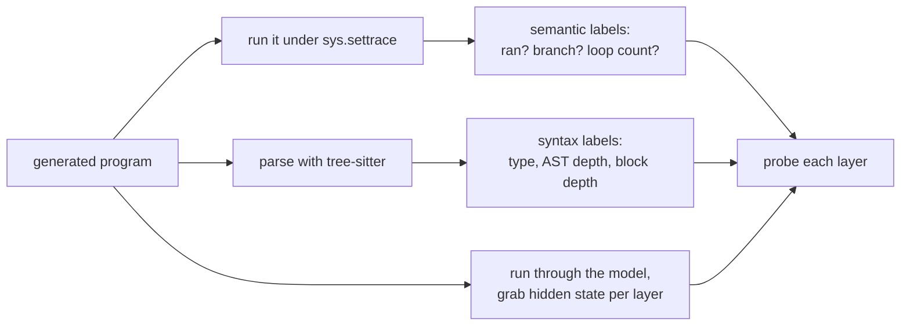

This is a progress report on a side project. The goal is simple to state and annoying to answer:
when a language model reads code, how much does it actually know about what that code *does*, versus
just knowing how code tends to look?

People fight about this with examples. One person shows a model fixing a tricky bug and calls it
understanding. Another shows it failing at something a first-year student would get right and calls
it autocomplete. Both examples are real and neither one settles anything.

So I stopped asking the big question and picked a smaller one I could measure:

> While a code model reads a program, what information is sitting in its hidden states? Just the
> surface text? The grammar? Or something about what happens when you run the program?

This post covers what I found and what I had to build to find it. Most of the work was the building,
so I'll go in roughly the order the problems came up.

## Three things a model might know

Take one line of code:

```python
x = a + b
```

A model could be holding any of these in its head when it reads that line:

1. **The text.** `=` usually comes after a name. `+` usually sits between two things. Pure surface
   pattern.
2. **The grammar.** This is an assignment. `a + b` is an expression. The line lives inside some
   block, maybe a loop, maybe an `if`. This is what a parser knows.
3. **What actually happens.** Did this line even run? Which branch was taken to get here? What value
   does a variable hold at this point? You only know this by running the program.

A decent code model probably has some of all three. The questions worth asking are *which* one,
*where* in the network it shows up, and whether the model worked it out or just read it off the
tokens. That last part matters most. Knowing `while` is a keyword is free, it's right there in the
text. Knowing that a line inside an untaken `else` never ran is a different kind of claim.

## I had to generate the programs

To ask "does the model know whether this line ran?", I first need to know whether it ran. Real code
from GitHub doesn't come with that label, and it drags in files, network calls, and libraries that
make the answer depend on things outside the snippet.

So I generate the programs myself, 150 of them, and run every one. They're deliberately plain: integer
variables, assignment, `if`/`else`, `for`, and `while`. The `while` loops count down to zero so
nothing runs forever. A typical one:

```python
v0 = 2
v1 = 6
c2 = 4
while c2 > 0:
    c2 -= 1
    if v0 > v1:
        v0 = v0 - 1
    else:
        v1 = v1 - 1
```

The labels come from two places. For *what happens*, I run each program under Python's tracer
(`sys.settrace`) and record, line by line, which lines ran, which branch was taken, how many times
each loop repeated, and the value of every variable before and after. That isn't a guess about what
the code might do. It's a recording of what it did.

For *grammar*, I parse the same program with [tree-sitter](https://tree-sitter.github.io/), which
gives me, per token, its syntax type, its depth in the parse tree, and how deeply nested it is in
control blocks.

So every token ends up with two kinds of ground truth: what it is, and what happened to it.



## Reading the hidden states: probing

A transformer keeps a separate vector for every token at every layer: after the embedding (call it
layer 0), then after layer 1, layer 2, and so on. People call this running representation the residual
stream.

The method is probing, an idea borrowed from NLP interpretability
([Hewitt and Manning](https://aclanthology.org/N19-1419/) used it to read parse trees out of BERT).
It's straightforward. Freeze the model. Run a program through it and pull
out those per-layer vectors. Then, for one property at a time (say, "did this line run?"), train a
small classifier to predict it from the vector. One probe per layer. If a probe reads the property
off layer 12 but not off layer 0, the model made that information more available somewhere in
between.

The probes are linear (multinomial logistic regression). I fit them on the GPU with L-BFGS, one per
layer. Keeping them linear is the point: if a *simple* readout can find the property, it's genuinely
sitting in the representation, not something a big probe invented.

Two easy ways to fool yourself here, so two rules:

- **Split by program, not by token.** Training and test sets never share tokens from the same
  program. Otherwise the probe memorizes half a program and aces the other half.
- **Always beat the majority guess.** "80% accuracy" means nothing if 80% of the labels are the same
  value. The baseline is guessing the most common label.

### The baseline problem, and the fix

There's a standard check for "is the probe just memorizing tokens?" called the control task
([Hewitt and Liang, 2019](https://arxiv.org/abs/1909.03368)): scramble
the labels into noise and confirm the probe *can't* fit them. If it can, your probe is too strong and
its score is meaningless.

In my setup that check is useless. The vocabulary is tiny and the hidden states are big, so a linear
probe fits *any* random labelling almost perfectly. The control task always passes and tells me
nothing.

So I use a different reference point: the embedding layer. Layer 0 is where raw token identity is
strongest, before the model has done any work. If a property is already readable there, the probe is
basically reading the token. What I care about is how much *better* it gets deeper in:

$$
\text{lift} = a_{\ell^\star} - a_0
$$

where $a_0$ is the probe's accuracy at the embedding and $a_{\ell^\star}$ is its best accuracy at any
layer. Same probe, same tokens, same labels. Only the layer changes, so probe capacity can't game
it. The lift is the part I'm willing to call "computed by the model."

## Getting it to actually run

The first version ran on my laptop with sklearn probes and a cap on how many tokens I'd use, because
otherwise it was too slow to iterate on. That was fine for the 0.5B model and one experiment. It fell
apart the moment I wanted four model sizes and the full token set.

A few changes fixed it, and they're the boring kind of engineering that ends up mattering:

- I moved the probes to torch on the GPU, so I could drop the token cap and train on everything. The
  probe is still linear. The GPU is just for speed and for keeping one pipeline across all sizes.
- The 3B and 7B models don't fit comfortably on my machine, so extraction runs on a rented GPU
  (RunPod). One script extracts activations on the pod; the probing can run
  anywhere off the cache.
- I cache the activations to disk so I extract once and probe many times. Two bugs showed up here
  that were worth catching: a Ctrl-C left a half-written cache file that silently loaded as garbage,
  and compressing the cache turned out to be slower than writing it raw (fp16 activations barely
  compress). Atomic writes and uncompressed files fixed both.

None of this is clever. But without it I'd have one result on one small model instead of the same
experiment run cleanly across a 14× range of sizes.

## First result: grammar early, behaviour late

Here's the 0.5B model, every property, on the 150 programs (about 41k tokens, 17k of them
identifiers, which is what most of the probes run on). "Layer 0" is the embedding baseline and
"lift" is the gain over it.

| property | kind | best acc | layer 0 | lift |
|---|---|---|---|---|
| token type | text (control) | 1.000 | 0.905 | +0.095 |
| block nesting depth | grammar | 0.980 | 0.468 | **+0.512** |
| AST depth | grammar | 0.891 | 0.307 | **+0.583** |
| in a repeating loop | behaviour | 0.846 | 0.678 | +0.168 |
| did this line run | behaviour | 0.812 | 0.754 | +0.058 |

The grammar lifts are large, around half. The behaviour lifts are small, and they turned out to be
misleading.

This ordering is not new. [Tenney and colleagues](https://arxiv.org/abs/1905.05950) showed BERT runs
the classical NLP pipeline in layer order, syntax before semantics, and for code the
[AST is linearly recoverable](https://arxiv.org/abs/2206.11719) from a model's hidden states. So
grammar early, behaviour late. The catch is that the behaviour half is not really behaviour.

## Those behaviour numbers are a trap

In these programs, whether a line runs is almost decided by *where it sits*. Top-level lines always
run. Loop bodies always run, because the loops always go around at least once. The only way a line
doesn't run is if it's inside an `if`/`else` branch that wasn't taken:

| block nesting depth | share of tokens whose line did NOT run |
|---|---|
| 0 (top level) | 0% |
| 1 | 22.7% |
| 2 | 41.4% |

So "did this line run" is mostly "how nested is this", and the model reads nesting depth nearly
perfectly. "In a repeating loop" is worse. That label is really "is this token inside a loop body
rather than a conditional body", which is pure grammar; tree-sitter hands it over for free. A probe
can score on either label without tracking anything about execution, just by reading structure. The
embedding baseline doesn't help, because the structure isn't in the raw tokens either, and the model
computes it in the first few layers. The behaviour signal could just be grammar in disguise.

To check, I stripped the shortcut out. I kept only the tokens where execution is genuinely uncertain,
the ones inside conditional branches, and held the nesting depth fixed so the structure can't hand
over the answer. The "did this line run" signal drops to the noise floor, a point or two that doesn't
reliably clear its own error bars. The "in a repeating loop" number mostly evaporates: once every
token is already inside a loop, the probe can't tell the loop that ran twice from the one that ran
once. Most of what looked like behaviour tracking was the model reading the layout.

The general lesson: if a behaviour label lines up with some structure the model is good at, assume the
structure is doing the work until you can show otherwise.

## A cleaner question: does it track the value?

The fix isn't a better control on a bad label. It's a better label. So I asked the model something the
grammar genuinely can't give away: what is the actual value of this variable, right here?

I take each variable's traced value and bucket it to its sign (negative, zero, or positive), then ask
a linear probe to read that off the hidden state. Nothing about the program's structure tells you
whether `v3` is negative; you have to do the arithmetic. So if a simple probe recovers the sign, that's
the model tracking the computation, not the layout. This is the same kind of program-state probe
[Jin and Rinard](https://arxiv.org/abs/2305.11169) ran on grid-world programs, and the
[Othello-GPT](https://arxiv.org/abs/2210.13382) board-state result before it.

This one survives. On the 0.5B the embedding already scores about 0.65, because variable names leak a
little sign (counters and loop variables are never negative). A probe in the early layers pulls that up
to 0.73, a lift of about **+0.085**, steady across five train/test splits and well clear of the noise.
So the model is tracking variable state. Not strongly, but it's there. The next question was whether a
bigger model tracks it better.

Here's the 0.5B picture: lift over the embedding against depth in the network, for the two grammar
properties and the value-sign probe.


The grammar curves shoot up in the first fifth of the network and stay high. The model works out where
it sits in the block structure almost immediately. The value-sign curve has the same early-rising shape
but is much smaller. It lifts in the first few layers, tops out around +0.085 (a fraction of the grammar
lift), and flattens. The model computes a little about the values, fast, and then stops.

## Scaling: grammar resolves earlier, the value signal doesn't move

I ran the same pipeline on four sizes of Qwen2.5-Coder: 0.5B, 1.5B, 3B, and 7B. One thing first: they
aren't all the same depth (24, 28, 36, and 28 layers), and the 7B is actually shallower than the 3B.
So to compare *where* a property resolves, I use relative depth, the peak layer over the total:

$$
d = \ell^\star / L
$$

The clean thing grammar does as the model grows is move to the front. Block-nesting depth is already
decoded almost perfectly at every size, 0.98 to 1.00, so there isn't much room to get better, and AST
depth even dips at 1.5B before recovering, so I wouldn't read an accuracy trend into it. What does
change cleanly is where the grammar resolves. The peak slides from about a third of the way into the
network at 0.5B to the first tenth by 3B.

| property | size | best acc | lift | peak depth |
|---|---|---|---|---|
| block nesting depth | 0.5B | 0.980 | +0.512 | 0.38 |
| | 1.5B | 0.990 | +0.523 | 0.11 |
| | 3B | 1.000 | +0.533 | 0.08 |
| | 7B | 0.998 | +0.531 | 0.11 |
| AST depth | 0.5B | 0.891 | +0.583 | 0.38 |
| | 1.5B | 0.865 | +0.558 | 0.07 |
| | 3B | 0.921 | +0.614 | 0.08 |
| | 7B | 0.919 | +0.610 | 0.11 |

Bigger models lock the grammar in sooner, then spend the rest of their depth on something else.

(One caveat on this table: the grammar accuracies are single-split point estimates, not 5-seed like
the semantic numbers below, so I wouldn't lean on differences in the third decimal. The peak-depth
shift is the part that's large and consistent enough to trust.)

The value signal does the opposite of what you'd hope: it stays flat. Here's the value-sign lift over
the embedding across the four sizes:

| property | 0.5B | 1.5B | 3B | 7B |
|---|---|---|---|---|
| value sign (lift over embedding) | +0.085 | +0.085 | +0.073 | +0.061 |

Across a 14× jump in parameters the signal doesn't grow. The drop from 0.085 to 0.061 is within the
error bars, so I read it as flat rather than declining. I also tried the branch-taken label, holding
nesting depth fixed, but it sits at the noise floor: a few points that barely clear their own error
bars and jump around with the random split, so I won't lean on it. Value-sign is the one execution
signal clean enough to trust. Whatever the extra capacity is buying, it isn't a stronger linear grip on
what the program is doing.


## What I think this means

Scale buys earlier grammar: the model settles it sooner, not more accurately. It doesn't buy a stronger
linear grip on what the program does.

That surprised me. Tracking the computation feels like the deep thing, the part a bigger model should
unlock. Instead the value signal is already there at 0.5B, computed in the first few layers, and it
stays about the same as the model grows 14×. The extra capacity is going somewhere. It isn't going into
a stronger linear "what is this value" feature.

What holds up: the model does carry a little program state. The value-sign probe is small but steady at
every size, which lines up with [Jin and Rinard](https://arxiv.org/abs/2305.11169), who found
program-state representations in models trained on grid-world programs, and with the
[Othello-GPT](https://arxiv.org/abs/2210.13382) board-state result. One difference is the axis. They
watch a signal emerge over training in models built from scratch; I hold training fixed and vary size.
So "present but flat with scale" doesn't contradict "emerges over training". What I won't claim is the
bigger version of the story. The labels that looked like strong execution tracking, "did this line run"
and "in a repeating loop", were mostly the model reading structure, and they fall apart once you control
for it. The signal that survives is the quiet one: a small, structure-free trace of variable values that
doesn't care how big the model is.

A few caveats, because this is easy to over-read:

- **These are toy programs.** Small integer snippets, no libraries, no real data structures. The flat
  result might be a ceiling of the task rather than the models. There may be little value signal left to
  find in programs this easy. This is the caveat I most want to kill next.
- **This is correlation, not use.** A probe shows the information is present, not that the model uses
  it when it writes code. Probing only speaks to the first.
- **One family, linear probes.** Everything here is Qwen2.5-Coder, and a linear probe only sees what's
  linearly available. Value tracking could be richer and non-linear, and I'd be undercounting it.

## What's next

The probe says the value signal exists and stays flat. It can't say whether the model *uses* it. The
next step is to intervene: patch the value direction in the residual stream (with
[nnsight](https://nnsight.net/)) and see if the model's own output moves. If it does, the model is
acting on that state, not just storing it. That mirrors the interventional check
[Jin and Rinard](https://arxiv.org/abs/2305.11169) used to tell apart what the model represents from
what the probe just learned to read.

The bigger lever is the programs themselves. They're deliberately trivial, and the flat result might
be the task running out of signal rather than the models running out of capacity. The plan is to make
them harder while keeping the clean ground truth: more variables, and branch conditions that depend on
computed values, so the model has to track state to get them right. Then, eventually, real code with
supplied inputs. After that, cross-language transfer: train the probe on Python, test on Java or C++,
and see whether any of this is shared structure or just Python surface.

The code and the raw numbers are in a repo that I'll make public soon. This is the first write-up; more as the programs get less toy-like.

## References

- Ian Tenney, Dipanjan Das, Ellie Pavlick. [BERT Rediscovers the Classical NLP Pipeline](https://arxiv.org/abs/1905.05950). ACL 2019.
- John Hewitt, Christopher D. Manning. [A Structural Probe for Finding Syntax in Word Representations](https://aclanthology.org/N19-1419/). NAACL 2019.
- John Hewitt, Percy Liang. [Designing and Interpreting Probes with Control Tasks](https://arxiv.org/abs/1909.03368). EMNLP 2019.
- José Antonio Hernández-López, Martin Weyssow, Jesús Sánchez Cuadrado, Houari Sahraoui. [AST-Probe: Recovering Abstract Syntax Trees from Hidden Representations of Pre-trained Language Models](https://arxiv.org/abs/2206.11719). ASE 2022.
- Charles Jin, Martin Rinard. [Emergent Representations of Program Semantics in Language Models Trained on Programs](https://arxiv.org/abs/2305.11169). ICML 2024.
- Kenneth Li, Aspen K. Hopkins, David Bau, Fernanda Viégas, Hanspeter Pfister, Martin Wattenberg. [Emergent World Representations: Exploring a Sequence Model Trained on a Synthetic Task](https://arxiv.org/abs/2210.13382). ICLR 2023.
