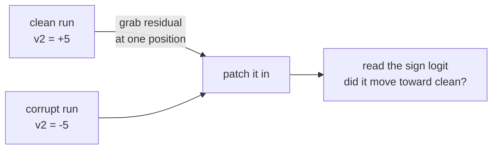

The [last post](https://onlychan.xyz/blog/probing-code-models/) left a hole in it. I probed four sizes of Qwen2.5-Coder and found that a small, linear
trace of a variable's sign sits in the hidden states, early, and barely changes as the model grows.
Then I said the honest thing: a probe only shows the information is *there*. It can't tell you the
model ever *uses* it. A probe reads the residual stream from the outside. The model might be doing the
same and acting on it, or the information might just be sitting there like lint.

So this post tries to tell those two apart.

> The probe says the sign is present. The question now is whether the model reads its own
> representation of the sign when it decides what to write next.

The tool for this is [activation patching](https://arxiv.org/abs/2404.15255): change one piece of the model's internal state mid-run and
watch whether the output changes. If editing the sign flips what the model predicts, the model was
using it. If nothing moves, the sign was a passenger.

## You need a behaviour that depends on the sign

Patching only tells you something if there's an output that should react. In the free-form programs
from the last post there usually isn't. The model reads a line, but nothing about the next token
hinges on whether `v3` happens to be negative right now. So there's nothing to move, and patching has
nothing to say.

So I made a setup where the sign is the whole point. Two numbers, one subtraction, then print the
result:

```text
>>> v0 = 7
>>> v1 = 2
>>> v2 = v0 - v1
>>> v2
```

The model has to predict what comes after that last line. If it worked out that `v2` is positive, it
should write a digit. If it worked out `v2` is negative, it should write a minus sign first. So the
first output token carries the sign, and I can read it straight off the logits: take the logit of `-`
and the logit of the digits, and [their difference](https://arxiv.org/abs/2211.00593) is a number that's high when the model thinks the
result is negative and low when it thinks it's positive.

I tried an even simpler version first, asking the model `v2 > 0` and reading `True` or `False`. That
one was useless. The model says `True` almost regardless of the actual value, a flat prior toward yes,
so the negative cases all come back wrong and there's no real signal to push on. The print version is
better because the model genuinely has to commit to a sign to produce the leading character. On the
1.5B model it gets the sign right about 90% of the time on a balanced set, which is enough behaviour to
work with.

## The patch

The clean way to patch is with paired runs that differ in exactly one thing. I build pairs by swapping
the two operands:

```text
clean:    v0 = 7   v1 = 2   ->  v2 = +5
corrupt:  v0 = 2   v1 = 7   ->  v2 = -5
```

Same numbers, opposite sign, and the line `v2 = v0 - v1` is character-for-character identical in both.
Only the two literals on the definition lines differ. So if I patch a position that holds the *name*
`v1` rather than a literal, I'm moving a piece of computed state, not editing the input.

The run is: take the residual at one position from the clean run, drop it into the same position of the
corrupt run, and see how far the output moves back toward the clean answer. I score it as a recovered
fraction:

$$
\text{recovered} = \frac{R_{\text{corrupt}} - R_{\text{patched}}}{R_{\text{corrupt}} - R_{\text{clean}}}
$$

where $R$ is that sign logit. One means the patch moved the sign logit all the way from the corrupt
value to the clean one, zero means it did nothing. This is a continuous measure of how far the logit
moved, not a count of how often the model's top guess flipped. I run it both directions (clean into
corrupt and corrupt into clean) and average, and I only keep pairs the model already gets right, since
the fraction is meaningless when there's no swing to recover.



Three things to patch with. The whole residual at a position, which is the ceiling on what's there.
Just the component along a sign direction, which is the real question, because if a single direction
carries the effect then the sign is stored linearly. And a random direction of the same size as a
control, which should do nothing.

## The obvious place is the wrong place

My first guess for where the sign lives was the `v2` token on the last line, the query the model reads
just before it prints the value. The probe from the last post reads the sign off that token almost
perfectly, better than 0.9. It's the most decodable spot in the whole sequence. So patch it and the
output should swing.

It doesn't. Patching the full residual at the `v2` query token does almost nothing, and when I later
swept every position it stayed flat the whole way down the network, a peak of 0.02 on the 3B. The sign
is sitting right there, perfectly readable, and the model ignores it when it writes the answer. (This
is a different token from the very last one in the prompt, where the model actually generates; that one
is alive, and I come back to it below.)

That gap is the whole point of doing the causal test. The token where a probe reads the sign best is
not the token the model uses. The model is re-deriving the value at the moment it prints, by looking
back at the arithmetic, not by reading the tidy copy of the sign that's sitting under the variable
name. Decodable is not the same as used, and here they're in different places.

## Where it actually lives

So I swept every position instead of guessing. For each token in the prompt, patch its full residual
across a range of layers and see which ones move the output. To keep positions lined up across pairs I
used single-digit operands, so every prompt tokenizes the same way.

Two kinds of position light up for boring reasons. The operand literals, because changing them changes
the input. And the very last token, the newline where the model is about to generate, at a late layer,
because that is just the model committing to its answer. That generation token is the single biggest
bar in the sweep, recovering nearly all of the swing, and it is a different token from the dead `v2`
query a few positions earlier. The interesting position is the largest one that is neither an input nor
the output itself. On every model that is the `v1` token inside `v2 = v0 - v1`, the second operand of
the subtraction. That's the point in the text where both operands are available and the subtraction
resolves. The model computes the result there, parks the sign on that token, and carries it to the
output.


The smaller models smear it a little, across the whole right-hand side and the newline before it. The
bigger models concentrate it almost entirely on that one `v1` token. So scale doesn't spread the
computation out; if anything it sharpens it to a point.

## A wrong turn worth admitting

Before the position sweep I ran a coarser version of this that patched the assignment line as a block,
at a handful of layers I'd picked by hand. On the two small models it found the effect. On the 3B and
7B it found nothing, clean zeros everywhere, even though those models do the task perfectly. I had a
tidy story ready: small models commit the value to the residual stream, big models compute it
just-in-time at the output and leave the middle empty. Small models bind, big models defer.

It was wrong. The layers I'd picked by hand were `{... 8, 18, 36}`, and the 3B model's effect peaks at
layer 22, which sits in the gap I skipped. The finer sweep walked right onto it. The 3B doesn't defer
at all. The effect is right there, as clear as on the small models, at a layer my grid happened to jump
over.

The lesson is dull and worth repeating: when you compare *where* something happens across models of
different depths, never pick layers by hand. A handful of probe points will straddle a peak and hand
you a clean, false result. Sweep everything.

## It's one linear direction, at every size

Back to the real question. At each model's true peak, I compared four patches: the whole residual, a
sign direction I read out of this task, the value-sign direction from the last post, and a random
direction. If a single direction recovers most of what the whole residual does, the sign is stored
linearly and the model is reading it off that line.

It does, everywhere, for the in-task direction.

| size | peak layer | pairs | whole residual | in-task direction | last post's direction | random |
|---|---|---|---|---|---|---|
| 0.5B | 14 | 16 | 0.40 | 0.37 | 0.00 | 0.00 |
| 1.5B | 14 | 25 | 0.29 | 0.29 | 0.00 | 0.00 |
| 3B | 22 | 36 | 0.61 | 0.60 | 0.00 | -0.00 |
| 7B | 17 | 36 | 0.45 | 0.41 | 0.00 | 0.00 |

Two different ratios, so keep them apart. The in-task direction reproduces 91% to 100% of what the
*whole-residual* patch does at the same spot, while a random direction of the same length does nothing.
That's the linearity claim: the part of the sign the model acts on is a [single axis](https://arxiv.org/abs/2309.00941) at one token. But
the whole-residual patch itself only moves about a third to two-thirds of the swing (it tops out around
0.6, on the 3B), so this one token is not the entire story of how the model answers; the rest is spread
across other positions or done at the output. The piece that's here is clean and linear. Hold the
fourth column for a second.

(The "pairs" column is how many minimal pairs each row averages over, after keeping only the ones the
model already gets right. The 0.5B rests on 16, so I wouldn't read its third decimal. What holds is the
gap between the in-task direction and the controls, and a bootstrap over pairs puts that gap far
outside the noise: even on the 0.5B, the smallest set, the in-task direction's 95% interval is
[0.32, 0.43], while the free-form and the random directions both sit at [0.00, 0.00]. The larger sizes
only sharpen it.)


And it does not fade with scale. The bigger models show it at least as clearly as the small ones, not
less. I wouldn't read the exact ordering of the numbers too hard, since the recovered fraction at each
size rides on a different set of pairs the model got right. But the last post worried that the value
signal might be a small thing that scale leaves behind, and the causal version is plainly alive at
every size.

## The direction the probe found is not the one that's used

That fourth column is the catch I have to be honest about. The sign direction that works here is one I
read out of *this* task, from the subtraction prompts. It is not the value-sign direction from the last
post, the one fit on the free-form programs. I tried that one too. I fit it on the probing corpus
exactly as before, then patched it in at the same token and the same layer where the in-task direction
does its work, not at some other layer where I might have missed it. It recovers nothing, dead on the
random control, at every size, while the in-task direction sitting right next to it carries most of the
effect.

So the two directions are different objects. The free-form probe finds a weak, real sign signal in
messy code (about 0.68 area-under-curve in its own setting, which matches the small lift from last
time), but that exact axis is not what drives the behaviour here. The causal direction lives in the
arithmetic task and points somewhere else.

This stops me from claiming the clean thing I wanted to claim, that the signal the last post found is
the signal the model uses. I didn't show that. What I showed is narrower and a little stranger: the
model *can* hold a value's sign as a single linear direction and act on it, but the place it's most
readable and the direction a probe pulls out of general code are both off to the side of the thing that
actually does the work.

## What I think this means

Three things hold up.

The model acts on the sign. In a setting where the answer depends on a computed sign, editing one
linear direction at one token moves the prediction toward the opposite sign, most of the way on the 3B
and partway on the smaller models. That's a stronger statement than the probe could make, and it's the
question the last post couldn't answer.

It's linear, and it's at the arithmetic. The sign the model acts on is a single direction sitting on
the second operand of the subtraction, the moment the value resolves, not on the token where you'd read
it most easily. Bigger models put it more sharply in that one spot.

And the easy reads are traps. The most decodable token was causally dead. The hand-picked layer grid
invented a scaling story that the full sweep erased. Both times the clean-looking shortcut pointed the
wrong way.

A few caveats, same spirit as before.

- **This is a toy task.** One subtraction in a REPL prompt. It's a clean place to ask the question, but
  it's not real code, and "the model uses the sign here" doesn't promise it routes state this tidily in
  a hundred-line file.
- **It's a different distribution from the probe.** I had to leave the free-form programs to get a
  behaviour I could push on. So this complements the last post, it doesn't confirm it. The direction
  that's causal here and the direction the probe found there are not the same, and I've said so.
- **One family, linear edits.** Still all Qwen2.5-Coder, and I'm patching along single directions. A
  richer, non-linear part of the sign computation would be invisible to this.

## What's next

The obvious gap is the one in the middle of this post: the causal direction and the probe direction
don't match. I'd like to know whether that's because the free-form signal is genuinely a different,
weaker thing, or because my arithmetic task is too easy and only exercises a shortcut. Harder programs,
where a branch actually depends on a computed sign, would force the model to carry the value through
more of the network and might line the two up.

After that, the thing I keep putting off: cross-language. Train the read-out on Python, test it on Java
or C++, and see whether the place the model parks a value's sign is shared structure or just Python.

## References

- Kevin Meng, David Bau, Alex Andonian, Yonatan Belinkov. [Locating and Editing Factual Associations in GPT](https://arxiv.org/abs/2202.05262). NeurIPS 2022.
- Kevin Wang, Alexandre Variengien, Arthur Conmy, Buck Shlegeris, Jacob Steinhardt. [Interpretability in the Wild: a Circuit for Indirect Object Identification in GPT-2 small](https://arxiv.org/abs/2211.00593). ICLR 2023.
- Stefan Heimersheim, Neel Nanda. [How to use and interpret activation patching](https://arxiv.org/abs/2404.15255). arXiv 2024.
- Neel Nanda, Andrew Lee, Martin Wattenberg. [Emergent Linear Representations in World Models of Self-Supervised Sequence Models](https://arxiv.org/abs/2309.00941). BlackboxNLP 2023.
- Charles Jin, Martin Rinard. [Emergent Representations of Program Semantics in Language Models Trained on Programs](https://arxiv.org/abs/2305.11169). ICML 2024.
- Kenneth Li, Aspen K. Hopkins, David Bau, Fernanda Viégas, Hanspeter Pfister, Martin Wattenberg. [Emergent World Representations: Exploring a Sequence Model Trained on a Synthetic Task](https://arxiv.org/abs/2210.13382). ICLR 2023.
